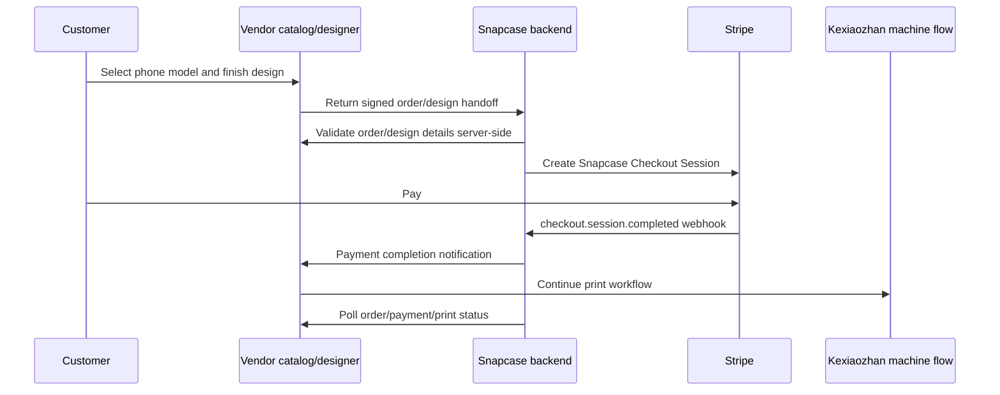

# Kexiaozhan Apifox Reference

Last updated: 2026-06-09

Purpose: give Snapcase agents a durable working model of the Kexiaozhan/Xiaojiang
API contracts without requiring live Apifox access for every task.

Source handling: the Apifox site is password-protected. Do not commit the
password, tokenized machine URLs, machine keys, Stripe secrets, webhook secrets,
or shared callback secrets into this repository.

Latest payment-specific guide: see
`Docs/KEXIAOZHAN_WEBHOOK_PAYMENT_GUIDE.md`. It captures the 2026-06-07 vendor
email confirmation and the latest webhook payment guide. That newer guide uses
fixed `/client/...` payment endpoints and HMAC-SHA256 with `machineKey`, which
supersedes the older Apifox MD5 callback notes for new payment integration work
unless the vendor explicitly says otherwise.

## Executive Summary

The vendor response confirms a viable target architecture: the customer can use
the vendor catalog/designer, Snapcase can own Stripe payment and shipping, then
Snapcase can notify the vendor system after payment so the machine flow can
continue.

Latest vendor response on 2026-06-07 confirms the intended flow remains:
customer completes vendor catalog/designer, vendor creates an unpaid order,
customer proceeds to Snapcase Checkout, Snapcase confirms Stripe payment
server-side, Snapcase calls the vendor payment completion callback, and the
vendor system pushes the print job into the production queue.

Chief engineer clarification on 2026-06-08 confirms the vendor-to-Snapcase
`webhookUrl` query parameters, HMAC-SHA256 signing string, timestamp/nonce
fields, and that `/client/process-payment-notify` and `/client/query-status` do
not require JWT, Cookie, or Bearer token authentication.

Latest chief engineer clarification also confirms Snapcase should send the
Stripe PaymentIntent ID as `transactionId`, and `payTime` should be UTC RFC3339.

Further vendor clarification confirms there is no order validation API right
now; `/client/query-status` is the current payment-status API, returns
`status: 0` unpaid or `status: 1` paid, and should be polled less frequently
than every 2 seconds. Print/order detail APIs and reprint APIs are still
forthcoming. Unpaid vendor orders time out after 15 minutes and then become
canceled.

The 2026-06-09 Gmail attachments are local debugging tools, not a final sandbox
credential package. They include:

- English and Chinese single-file HTML webhook/payment trigger pages.
- `local_webhook_proxy_threaded.py`, a local CORS proxy for
  `/client/process-payment-notify` and `/client/query-status`.
- `Webhook_Local_Trigger_Usage_EN.md`, which lists test domain
  `https://kxzcnt.kexiaozhan.com` and production domain
  `https://kxzus.kexiaozhan.com`.

The vendor confirmed on 2026-06-10 that the test API base is
`https://kxzcnt.kexiaozhan.com`, the production API base is
`https://kxzus.kexiaozhan.com`, and the current test environment has no IP
restriction or VPN requirement. Test machine credentials were provided out of
band; never commit the `machineKey`.

The attached Python proxy still defaults to `https://kxzsg.kexiaozhan.com`, and
earlier payment examples also used that domain. Treat that older domain as
historical unless the vendor explicitly reintroduces it.

The Apifox docs are most useful for four areas:

- Handling the signed vendor handoff before Snapcase checkout.
- Notifying the vendor after Snapcase Stripe payment.
- Querying order, payment, receipt, SKU, material, and printer queue state.
- Understanding the signature format expected for payment notifications.

The docs do not yet answer every production question. The public docs inspected
do not show an explicit security scheme, sandbox base URL, reprint endpoint, or
full designer return payload contract. Treat those as vendor blockers before
machine automation.

Common visible API shape: endpoint auth/security objects are empty in the
inspected Apifox pages. Most responses use `{ code, data, msg }`, where `code`
is generally `0=success`, `1=failure`.

## Recommended Integration Shape



Snapcase remains the system of record for customer identity, Stripe payment,
shipping address, support, order history, tracking, and rollback. Vendor data is
production input, not the commerce source of truth.

## Safety Rules

- Do not link public CTAs directly to a tokenized vendor URL.
- Store machine keys and callback secrets backend-only.
- Do not call mutating Kexiaozhan endpoints from production until the user
  explicitly approves that phase.
- Do not trust browser-returned order data by itself. Validate it server-side
  before opening Stripe Checkout.
- Do not let vendor payloads directly set Snapcase pricing, payment status,
  shipping, operator status, or tracking.
- Keep `FULFILLMENT_PROVIDER=printful` as the production default until pilot
  cutover is separately approved.

## Endpoint Inventory

| Area | Method | Path | Snapcase use |
| --- | --- | --- | --- |
| Payment | `POST` | `/client/process-payment-notify` | Latest fixed Snapcase-to-vendor payment completion callback after Stripe succeeds. Uses HMAC-SHA256 `machineKey` signing per `Docs/KEXIAOZHAN_WEBHOOK_PAYMENT_GUIDE.md`. |
| Payment | `GET` | `/client/query-status` | Latest fixed payment status query by `outTradeNo` and `machineSn`, signed with HMAC-SHA256. Returns `status: 0` unpaid or `status: 1` paid; poll slower than every 2 seconds. |
| Payment | `POST` | `/process-payment-notify` | Historical Apifox path. Do not implement this unprefixed path unless vendor reconfirms it. |
| Payment | `POST` | `/v1/apply-coupon-and-process-payment` | Vendor coupon/payment helper. Probably not part of Snapcase-owned Stripe flow unless vendor requires it internally. |
| Payment | `GET` | `/v1/payment/{out_trade_no}` | Query vendor payment object by external payment number. Useful for reconciliation. |
| Payment | `POST` | `/v2/payment` | Create Payment V2. Docs say "No free mode"; this may conflict with prepaid/internal Snapcase flow and needs vendor clarification. |
| Content | `GET` | `/v1/materials` | Retrieve material IDs and names for order creation/SKU mapping. |
| Content | `GET` | `/v1/material-categorys` | Retrieve material categories. Note the path spelling. |
| Product | `GET` | `/v3/goods-skus` | Retrieve phone-case SKU catalog, stock, material/process attrs, and search tags. |
| Device | `GET` | `/v1/machine-disclaimer` | Retrieve machine disclaimer/config content. Low priority for Snapcase checkout. |
| Device | `GET` | `/v1/machine-pay-methods` | Retrieve machine payment methods. Useful only if vendor requires internal payment mode. |
| Device | `GET` | `/v1/machines-print-queue` | Retrieve printer queue. Important for operator visibility and status reconciliation. |
| Order | `POST` | `/v1/order` | Create vendor order from `filePath`, `goodsSkuId`, material IDs, amount, platform, and type. Mutating: staging/sandbox only until approved. |
| Order | `GET` | `/v1/order-receipt/{order_no}` | Retrieve receipt/ticket details. Useful for operator runbook and reconciliation. |
| Order | `GET` | `/v1/order/{orderNo}` | Validate vendor order data and poll order status. |

## Latest Payment Webhook Guide

The latest vendor-provided payment guide is preserved in
`Docs/KEXIAOZHAN_WEBHOOK_PAYMENT_GUIDE.md`.

Key updates:

- Fixed callback endpoint:
  `POST https://kxzsg.kexiaozhan.com/client/process-payment-notify`.
- Fixed payment status query endpoint:
  `GET https://kxzsg.kexiaozhan.com/client/query-status`.
- `webhookUrl` no longer includes `notify_url`; do not derive callback/query
  endpoints from the third-party payment page URL.
- `webhookUrl` fields are `order_no`, `out_trade_no`, `amount`, `goods_name`,
  `currency`, `machine_sn`, `timestamp`, `nonce`, and `sign`.
- Payment callback body uses lowercase `sign` and `outTradeNo`, not uppercase
  `Sign` and not `orderNo`.
- Fixed `/client` payment APIs are signature-only; do not add JWT, Cookie, or
  Bearer token headers unless vendor later changes this requirement.
- Signatures use HMAC-SHA256 with backend-only `machineKey`; sort fields by
  ascending ASCII lexicographical order, exclude the signature field, exclude
  empty fields, join `key=value` with `&`, and output lowercase hex.
- Snapcase now has server-only HMAC helpers and vendor-vector tests in
  `supabase/functions/_shared/kexiaozhan-payment.ts`.
- `route-fulfillment-order` records dry-run payment notifications for onshore
  jobs with Kexiaozhan payment context; live POSTs remain disabled unless
  `KEXIAOZHAN_PAYMENT_NOTIFY_ENABLED=true`.
- Callback `transactionId` should be the Stripe PaymentIntent ID.
- Callback `payTime` should be UTC RFC3339, for example
  `2026-06-03T20:10:30Z`.
- There is no order validation API right now; vendor can add one later if
  needed.
- `/client/query-status` is payment-status only and should be polled less
  frequently than every 2 seconds.
- Print/order detail status APIs and reprint APIs are still forthcoming.
- Unpaid vendor orders cancel after 15 minutes.
- Local trigger tooling exists for manual signature/proxy testing. The tool
  defaults can lag the latest contract; prefer this doc for current field rules.
- Test/prod API base URLs are now confirmed; Snapcase still needs to provide a
  real test redirect intake URL before Kexiaozhan can redirect with
  `webhookUrl` query parameters.
- `out_trade_no` / `outTradeNo` is the vendor payment idempotency and
  reconciliation key.
- `amount=0` or `0.00` is valid for coupon-full-deduction cases and should not
  be rejected solely because it is zero.

Implementation implication: use a new server-only HMAC-SHA256 helper for the
real payment guide. Keep the older MD5 notes below only as historical Apifox
context until the vendor reconciles all docs.

## Earlier Apifox Payment Completion Callback (Historical)

Endpoint: `POST /process-payment-notify`

Expected body:

| Field | Required | Notes |
| --- | --- | --- |
| `Sign` | Yes | Vendor signature string. Case-sensitive uppercase field name. |
| `orderNo` | Yes | Vendor order number. |
| `transactionId` | Yes | Stripe transaction/payment identifier mapped by Snapcase. |
| `amount` | Yes | Amount as a string; decimals supported. |
| `extraInfo` | No | Optional string. Empty strings are excluded from the signature. |
| `orderStatus` | Yes | `0=Unpaid`, `1=Paid`, `2=Payment failed`. Numeric value is converted to string for signing. |
| `payTime` | Yes | Historical payment time string. For the current fixed `/client` callback, use UTC RFC3339. |
| `couponCode` | No | Optional string. Empty strings are excluded from the signature. |

Success response:

| Field | Notes |
| --- | --- |
| `code` | `0` means success; other values mean failure. |
| `msg` | Usually `success` on success. |
| `data` | Usually empty. |

Vendor-stated behavior: the callback is idempotent. Multiple successful callback
calls for the same order should produce a single print job. Snapcase should still
store its own idempotency record keyed by vendor `orderNo` plus Stripe payment
intent/session ID.

## Earlier Apifox Signature Algorithm (Historical)

The Apifox signature spec for payment result notifications is MD5-based. It is
not HMAC-SHA256.

Generation rules:

1. Start with all JSON body fields except `Sign`.
2. Remove fields whose value is the empty string.
3. Convert numeric fields such as `orderStatus` to strings.
4. Sort remaining keys lexicographically ascending by JSON field name.
5. Join as `key=value` pairs with `&`.
6. Append `&access_token=<shared-secret>`.
7. Compute MD5 and use a 32-character lowercase hexadecimal string.

Example signing order for the common callback fields:

```text
amount < orderNo < orderStatus < payTime < transactionId
```

Implementation implication: isolate this in a small server-only helper, for
example `buildKexiaozhanMd5Sign(payload, secret)`. Never expose the shared
secret to the browser. Because MD5 is weaker than modern HMAC schemes, Snapcase
must also validate that the vendor order belongs to an expected Snapcase order
and that the Stripe payment amount/status match before sending or accepting
state changes.

Open question: confirm whether this same signature format is also used for the
vendor-to-Snapcase designer/order handoff, or only for the Snapcase-to-vendor
payment completion notification.

## Vendor Payment APIs

These APIs exist in Apifox, but Snapcase should avoid them unless the vendor
confirms they are required for the prepaid/internal Stripe-paid flow.

`POST /v2/payment`

Docs summary: Create Payment V2. The endpoint description says "No free mode",
which may conflict with Snapcase's desired Stripe-owned payment model.

Request fields found in Apifox:

| Field | Required | Notes |
| --- | --- | --- |
| `orderNos` | Yes | Array of vendor order numbers. |
| `paymentMethod` | Yes | Payment method. Need vendor value for internal/prepaid flow. |
| `couponSn` | No | Optional coupon. |
| `currency` | No | Enum includes `CNY` and `USD`; default appears to be `CNY`. |
| `description` | No | Payment description. |
| `filePaths` | No | Array of file paths. Confirm whether needed for H5 designer output. |
| `outTradeNo` | No | External payment number. Could map to a Snapcase/Stripe reference if required. |
| `payType` | No | Needs vendor definition. |
| `paymentInstrument` | No | Needs value for Stripe-paid/internal flow if payment object is required. |
| `returnUrl` | No | Customer return URL. |

Response fields include `outTradeNo`, `payUrl`, `payUrlQR`, `paymentAmount`,
`orderNos`, `status`, and `ticketNo`.

`POST /v1/apply-coupon-and-process-payment`

Request fields found in Apifox:

| Field | Required | Notes |
| --- | --- | --- |
| `couponCode` | Yes | Vendor coupon code. |
| `orderNos` | Yes | Array of vendor order numbers. |
| `paymentMethod` | Yes | Vendor payment method. |
| `filePaths` | No | Array of file paths. |
| `payType` | No | Needs vendor definition. |
| `paymentInstrument` | No | Needs vendor definition. |

Response is similar to the vendor payment object and includes free/discount
metadata such as `isFreePayment`.

Implementation implication: Snapcase promo codes and Stripe payments should
remain Snapcase-owned. Only use these vendor payment endpoints if the lead
engineer confirms they are required to advance an already Stripe-paid order into
the machine workflow.

## Create Order Contract

Endpoint: `POST /v1/order`

Request schema: `orchestrator.CreateOrderItem`

Required fields:

| Field | Type | Notes |
| --- | --- | --- |
| `filePath` | string | Max length 255. Docs say Android uses local path, H5 uses OSS path. This is a major blocker until vendor confirms how Snapcase gets or uploads it. |
| `goodsSkuId` | integer | Vendor SKU ID. |
| `meateralIds` | integer array | Material IDs. The docs spell this `meateralIds`, not `materialIds`; confirm actual API spelling before coding. |
| `orderAmount` | string | Example: `88.90`. Snapcase should validate against expected price/cost mapping. |
| `paymentMethod` | string | Docs describe `0=System`, `1=Cloud Manager`, but enum currently shows only `"0"`. |
| `platform` | integer | `0=Pad`, `1=H5`. Customer designer flow should likely use `1`. |
| `type` | integer | `1=Phone case print`, `2=Screen protector`, `3=Album`. Snapcase case orders should use `1`. |

Optional fields:

| Field | Type | Notes |
| --- | --- | --- |
| `couponSn` | string | Optional coupon code. |
| `extraInfo` | string | JSON string, max length 1000. Candidate place for Snapcase order ID, not customer PII. |

Response schema: `orchestrator.CreateOrderResp`

Important response fields include `orderNo`, internal `id`, `goodsSkuId`,
`orderAmount`, `paymentAmount`, `discountAmount`, `isFreePayment`, `channels`,
`status`, `ticketNo`, `symbol`, `platform`, `quantity`, and `zoomRatio`.

Implementation implication: the real integration probably needs a two-step
handoff:

1. Vendor designer creates or prepares an unpaid order/design and returns
   `orderNo`, `filePath`, `goodsSkuId`, material IDs, preview URL, and selected
   model metadata to Snapcase.
2. Snapcase validates those details server-side before Stripe checkout.

Do not create production vendor orders from Snapcase until sandbox behavior,
auth, idempotency, timeout/cancel behavior, and payment completion are verified.

## Order And Payment Query Contracts

`GET /v1/order/{orderNo}` returns `order.Order`.

Important fields:

- `orderNo`, `outTradeNo`, `status`, `cancelType`
- `goodsId`, `goodsName`, `goodsSkuId`, `goodsSkuName`
- `machineId`, `machineName`
- `merchantId`, `merchantName`, `shopId`, `shopName`
- `orderAmount`, `paymentAmount`, `discountAmount`, `refundAmount`
- `paymentMethod`, `platform`, `type`
- `createTime`, `updateTime`, `finishTime`, `deleteTime`
- `extraInfo`

Order status values:

| Value | Meaning |
| --- | --- |
| `0` | Pending payment |
| `1` | Paid |
| `2` | Shipped |
| `3` | Completed |
| `4` | Cancelled |
| `5` | Refunded |

Cancel type values:

| Value | Meaning |
| --- | --- |
| `0` | None |
| `1` | User cancelled |
| `2` | Timeout |
| `3` | Merchant cancelled |

`GET /v1/payment/{out_trade_no}` returns `payment.Payment`.

Important fields:

- `outTradeNo`, `transactionId`, `orderNos`
- `status`, `paymentAmount`, `refundAmount`, `currency`
- `notifyUrl`, `paymentMethod`, `paymentTime`
- `description`, `transactionName`, `payerAccount`

Payment status values:

| Value | Meaning |
| --- | --- |
| `0` | Unpaid |
| `1` | Paid |
| `2` | Failed |
| `3` | Refunding |
| `4` | Refunded |
| `5` | Refund failed |

`GET /v1/order-receipt/{order_no}` returns receipt/ticket metadata, including
`QRCode`, `ticketNo`, `paymentInstrument`, `orderAmount`, `paymentAmount`,
`goodsSkuId`, and `goodsSkuName`.

Known `paymentInstrument` values include `creditCard`, `cash`,
`sycloudManager`, `stcloudManager`, `couponFree`, and `machineFree`.

## Catalog And SKU Contracts

`GET /v3/goods-skus`

Query parameters:

| Parameter | Required | Notes |
| --- | --- | --- |
| `brandId` | Yes | Vendor brand/category ID. Need authoritative mapping. |
| `goodsMaterialAttr` | No | Examples: `magnetic`, `ordinary`. |
| `displayMode` | No | `byGoodsSpec`, `all`, or `byMaterialSpec`; default comes from vendor config. |
| `goodsProcessAttr` | No | If omitted, docs say it defaults to ordinary. Example: `lenticular`. |

Response includes a `displayMode`, a `searchTag.model` list, and `list` entries
with SKU data.

Important SKU fields:

- `goodsSkuId`
- `name`
- `searchField`
- `goodsPrice`
- `goodsStock`
- `isSoldOut`
- `materialAttr`
- `processAttr`
- `coverImageUrl`
- `goodsImageUrl`
- `rendingImageUrl` (spelled this way in docs)
- `goodsExtendAttrs`, described as render image offset such as `108,99`
- nested `list` for related SKUs depending on display mode
- `symbol`

Implementation implication: Snapcase should cache or snapshot an authoritative
SKU/material mapping for pilot. Do not depend only on display names because phone
models, magnetic/ordinary variants, and material/process attrs can collide.

Open blocker: Apifox exposes `brandId` as a required SKU-list query input, but no
brand-list endpoint was found. The vendor must provide the authoritative `brandId`
source or mapping.

## Material Contracts

`GET /v1/materials`

Query parameters found in Apifox include `page`, `size`, and `categoryId`.

Response list entries include:

- `id`
- `title`
- `url`
- `thumbUrl`
- `categoryId`
- `type`: `0=background`, `1=main image`, `2=sticker`, `3=watermark`
- `status`: `0=pending`, `1=published`, `2=unpublished`
- `layerInfo`

`GET /v1/material-categorys`

The path is spelled `material-categorys` in Apifox. Response data includes
category `list` entries with `id`, `name`, `icon`, and `sort`, plus
`materialList` and `total`.

Implementation implication: Snapcase should internally call these `materialIds`,
but map to the vendor request spelling `meateralIds` until the vendor confirms
whether the typo is real.

## Device And Print Queue Contracts

`GET /v1/machine-disclaimer`

Apifox says `machine_id` is required, but the documented path does not include a
`{machine_id}` placeholder. Optional query `languageCode` is also shown. Treat
this endpoint as unclear until the vendor confirms path/query shape.

`GET /v1/machine-pay-methods`

Response entries include `code`, `name`, `desc`, `logoUrl`, `isDefault`, and
`payType`. This endpoint may be useful for discovering the internal/prepaid
payment method if `/v2/payment` is required.

`GET /v1/machines-print-queue`

Response queue items include:

- `orderNo`
- `taskId`
- `printStatus`: `0=not printed`, `1=printing`, `2=completed`
- `contact`: progress from `0` to `100`
- `goodsSkuId`
- `goodsName`
- `goodsAttrs`
- `goodsImageUrl`

Implementation implication: map printer queue state into `production_jobs`
metadata first. Do not collapse vendor machine state into customer-facing
tracking until the operator confirms print/pack/ship status.

## Fields Snapcase Should Store

For a real vendor-backed order, store these in `production_jobs` metadata or a
future vendor-specific table:

- Snapcase `order_id`
- Vendor `orderNo`
- Vendor `outTradeNo`, if payment object is created
- Vendor internal order `id`, if returned
- Vendor `taskId`, if a printer queue item exists
- `filePath`
- `previewUrl` or design preview reference
- `brandId`
- `goodsSkuId`
- material IDs using the exact vendor spelling required by the API
- selected model display name and normalized Snapcase model
- `materialAttr`, `processAttr`, magnetic/ordinary flag
- `orderAmount`, `paymentAmount`, `symbol`, and `zoomRatio`
- callback transaction ID sent to vendor
- last observed vendor order status and payment status
- last observed machine/print queue status, if available
- timestamps for vendor handoff, Stripe payment, payment notification, and last poll

Avoid storing full customer PII in vendor `extraInfo`. Use Snapcase order IDs or
opaque references instead.

## Fit With Current PR 27

PR 27 already adds the right staging rehearsal pattern:

- `FULFILLMENT_PROVIDER=onshore_manual` routes paid Stripe orders into
  `production_jobs`.
- `fake-vendor-design-complete` rehearses vendor-design-complete to Snapcase
  Stripe checkout without calling Kexiaozhan.
- The fake handoff uses HMAC-SHA256 and exact preview-origin checks.
- The fake handoff can carry optional Kexiaozhan payment context through to
  onshore job metadata for callback rehearsal.

When moving from fake to real vendor integration, do not replace the fake
contract in place. Add a new real vendor endpoint or service path so staging can
continue to test both:

- fake handoff for deterministic QA
- real vendor sandbox handoff for integration QA

The real vendor payment notification signer should use the latest HMAC-SHA256
`machineKey` guide unless vendor explicitly reconfirms an older MD5 endpoint for
a specific API.

## Implementation Plan For Real Sandbox Prototype

1. Add server-only `kexiaozhan` integration helpers:
   - base URL config
   - backend-only machine/API key config
   - HMAC-SHA256 payment notification signer from the latest payment guide
   - typed request/response validators
2. Add a real vendor handoff intake endpoint only after vendor confirms the
   signed return payload, sandbox URL, and auth scheme.
3. Treat the vendor designer as the creator of the unpaid vendor order before
   redirecting to Snapcase; no separate order-validation API exists today.
4. On handoff, validate:
   - signature
   - `orderNo`
   - `filePath`
   - SKU/material mapping
   - amount/currency
   - no tokenized URLs or secrets in the payload
5. Create Stripe Checkout from Snapcase-controlled pricing.
6. On Stripe webhook success, call `/client/process-payment-notify` with
   idempotency.
7. Poll `/client/query-status` for payment state no more frequently than every
   2 seconds. Add print/order detail polling when vendor provides those APIs.
8. Keep operator queue as fallback for failed callback, timeout, reprint, or
   unclear machine state.

## Open Vendor Questions

These remain blocking for machine automation:

1. What is the exact sandbox base URL, and does it require VPN from the US?
2. What auth header/parameter is required for non-`/client` APIs? The inspected
   OpenAPI pages show no explicit security scheme, but the lead engineer said
   the machine key must stay backend-only.
3. Does any non-`/client` payment endpoint still use the older MD5
   `access_token` signature, or does the latest HMAC-SHA256 `machineKey` guide
   supersede it for all payment-related endpoints?
4. How does the customer designer return or expose `filePath`?
5. Can Snapcase upload artwork directly to get `filePath`, or must `filePath`
   be produced by the vendor H5 designer?
6. How are `brandId`, `goodsSkuId`, `meateralIds`, magnetic/ordinary,
   material/process attrs, shelf/bin, and machine inventory mapped?
7. How does Snapcase target a specific machine for printing?
8. Where is the reprint API in Apifox? The lead engineer mentioned it, but the
    inspected docs did not show a reprint endpoint.
9. What are the reprint API's idempotency and failure rules?
10. What are the exact printer queue fields and status values beyond
    `printStatus=0/1/2` and `contact=0-100`?
11. Can Snapcase explicitly cancel a vendor order when Stripe checkout expires,
    or should Snapcase rely on the vendor's 15-minute timeout?
12. Can `extraInfo` safely carry Snapcase order IDs, and what is the max useful
    shape under the 1000-character limit?

## Agent Notes

- Prefer this doc for API contract context before browsing Apifox again.
- Browse Apifox only for unresolved field-level details, and keep credentials
  out of logs and commits.
- If docs disagree, `Docs/DECISIONS.md` still wins for project policy.
- If a new real integration endpoint is added, update this doc and
  `Docs/VENDOR_HANDOFF_CONTRACT.md` together so fake and real flows stay clear.
