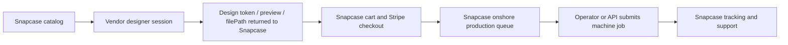

# Vendor Designer Research Sprint

Last updated: 2026-05-03

## Recommendation

Do not redirect public Snapcase CTAs directly to the current Kexiaozhan/Xiaojiang URL.

The recommended target is a hybrid model:

Snapcase should keep ownership of Stripe payment, shipping address, order history, support, tracking, and rollback. The vendor designer is valuable only if it can return a durable production asset or `filePath` without forcing the customer through vendor payment.

## Research Findings

- The vendor catalog has broader onshore SKU coverage than the current Snapcase catalog: Apple iPhone 11-17 families and Samsung Galaxy S21-S25 families, including ordinary and magnetic variants.
- The current vendor URL is token-gated. A fresh visit without token/session state renders blank, and `/photoEditing` without product/session state also renders blank.
- Product cards work visually but are not public, semantic links. Public accessibility, deep-linking, and analytics would need vendor support.
- After selecting a model, the vendor designer opens at `/photoEditing` with an image upload input, canvas controls, and a `Print` action.
- The visible `Print` path is the order/payment boundary. Read-only source review found order, payment, apply-coupon/payment, and signed upload paths, but no mutating call was made.
- The vendor UI appears closer to kiosk/operator flow than public e-commerce: token gate, print/history panel, machine/payment methods, and immediate print wording.
- Mobile works technically, but the current vendor layout is not polished enough for public Snapcase mobile traffic without a wrapper or vendor changes.

## Option Comparison

| Option | Fit | Benefits | Blockers | Decision |
| --- | --- | --- | --- | --- |
| Snapcase-owned designer and checkout | Medium | Keeps payment, shipping, support, order history, and rollback in Snapcase | Current designer/catalog weaker; machine automation still needs `filePath`, SKU, payment, and targeting answers | Safe current path |
| Vendor designer plus Snapcase checkout | Best target if vendor supports it | Better catalog/designer while Snapcase keeps commerce control | Needs deep link/session API, design return, `filePath`, SKU mapping, internal/prepaid machine order path | Recommended research target |
| Vendor-hosted customer flow | Weak fit | Fastest possible UX experiment | Exposes token/session risk, loses Snapcase checkout/control, unclear shipping/support/rollback, vendor payment conflict | Not safe as main pilot |
| Operator-only vendor tool | Useful fallback | Lets operators manually use vendor flow for fake/test orders | Not customer-facing; PII/payment transfer must be controlled | Safe only for controlled operator research |

## Lead Engineer / Vendor Question Pack

1. Can you provide a public-safe customer designer URL that does not expose bearer tokens in the URL?
2. Can Snapcase create a vendor designer session for a selected phone model/SKU and receive a return URL or callback when design is complete?
3. What exact endpoint uploads artwork and returns the `filePath` required by order creation?
4. Does the upload endpoint accept multipart files, base64, Snapcase-hosted HTTPS URLs, or only vendor-designer output?
5. What are the TTL, auth, tenant, environment, and machine-scope rules for returned `filePath` values?
6. Can Stripe-paid Snapcase orders create an internal/free/prepaid vendor machine order without customer-facing vendor payment?
7. Must `POST /v2/payment` still be called for prepaid/internal orders, and what payment/status fields are required?
8. How do we target a specific machine: token scope, `machineId`, order payload, print-routing endpoint, or post-order assignment?
9. What are the authoritative mappings for `brandId`, `goodsSkuId`, `materialIds`, phone model, finish, magnetic/ordinary, shelf/bin, and blank inventory?
10. How should Snapcase query per-machine SKU/material availability and out-of-stock states?
11. What artwork dimensions, DPI, bleed, safe area, orientation, color profile, file format, max file size, and transparency rules apply per SKU?
12. What callbacks or polling endpoints expose order, payment, queue, printing, printed, failed, canceled, refunded, and reprint states?
13. What idempotency keys should Snapcase use for upload, order creation, payment creation, print submission, cancellation, and reprint?
14. Can jobs be reassigned, reordered, canceled, retried, or reprinted through API?
15. What sandbox base URL, read-only tokens, non-production machine access, redacted schemas, and dummy order/print test path can you provide?

## Risk Register

| Risk | Severity | Mitigation |
| --- | --- | --- |
| Tokenized vendor URL becomes public | Critical | Never commit, log, or link it from frontend/docs; rotate before broader pilot |
| Vendor-hosted flow takes payment outside Snapcase | Critical | Keep Stripe as payment source of truth; require internal/prepaid vendor path |
| Snapcase loses shipping/order/support context | High | Keep checkout, order record, and tracking in Snapcase |
| Vendor `filePath` cannot be generated or reused | High | Block automation until upload/design-return contract is confirmed |
| SKU/material mismatch causes wrong blanks or finish | High | Require authoritative mapping and per-machine availability checks |
| Machine failure states are opaque | High | Require callback/polling states and manual fallback workflow |
| Existing broad preview origin matching remains | Medium | Tighten before merge/cutover |
| Staging/test secrets remain exposed after research | Medium | Rotate test Stripe key, preview bypass, route secret, and temp operator credentials after validation |

## Next Prototype Plan

1. Send the question pack to the lead engineer/vendor.
2. Ask for sandbox/read-only credentials and a non-production design/upload/order path.
3. If vendor can return a design token, preview, SKU, and `filePath`, prototype a Snapcase-controlled designer session wrapper in staging.
4. Keep Stripe checkout and `production_jobs` as the Snapcase system of record.
5. If vendor cannot support design return/prepaid order creation, keep vendor UI operator-only and continue Snapcase-native/manual queue work.

## Sprint Retro

- Product learning: the vendor catalog breadth is materially better than Snapcase today, but the current URL is not a public storefront.
- Functionality learning: the key integration point is not the CTA link. It is whether vendor design output can return to Snapcase as a production-ready asset before Stripe checkout or before machine submission.
- Operating-model learning: parallel API, UX, vendor UI, and security agents converged on the same guardrail: Snapcase should own commerce; vendor UX can be adopted only through a controlled integration.
